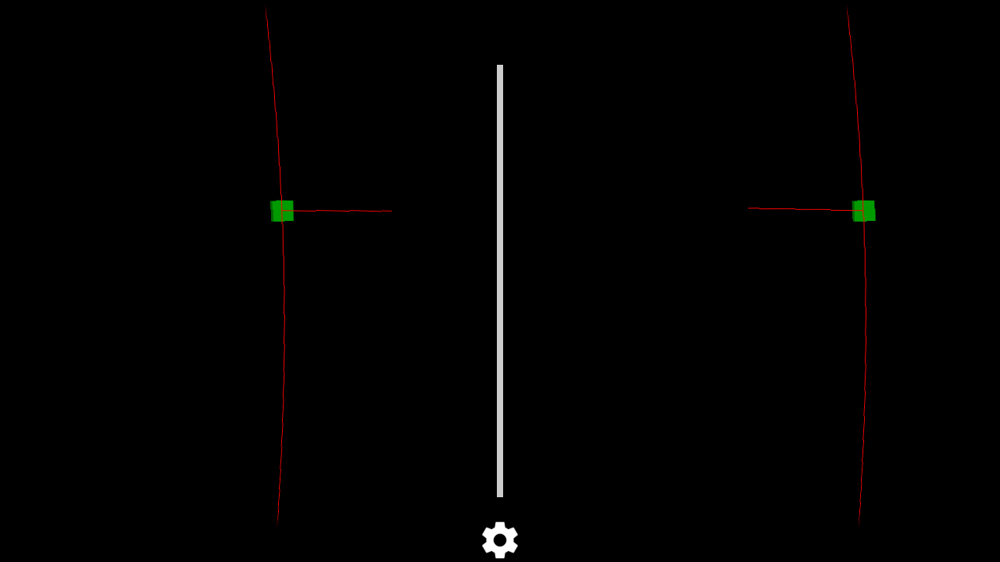
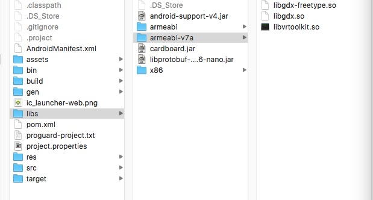

# Libgdx-CardBoard-Extension

#### a libgdx extension for cardboard app deveplopment


the cardboard sdk can only use OpenGL API to development app which is quite low efficiency. Now you can you use libgdx to develop CardBoard App.



## Setup

add in your project build.gradle

```groovy
repositories {
    .....your other repos
    jcenter()
}
```
add dependency
```groovy
compile "com.github.yangweigbh:libgdx-cardboard-core:0.2"
```

> Notice: in order to use this extension, you should also include dependency for 
```groovy
compile "com.badlogicgames.gdx:gdx-backend-android:1.7.1"
compile "com.badlogicgames.gdx:gdx:1.7.1"
```
also don't forget put cardboard.jar, libprotobuf-java-2.6-nano.jar and the natives so into libs folder, **you can get all the file in the Demo project**

>

## Usage

create your activity inherit from CardBoardAndroidApplication and implement CardBoardApplicationListener interface

```java
   class YourActivity extends CardBoardAndroidApplication implements CardBoardApplicationListener
```

in your activity `onCreate` method, do libgdx initialization like normal libgdx app

```java
	@Override
    protected void onCreate(Bundle savedInstanceState) {
        super.onCreate(savedInstanceState);
        AndroidApplicationConfiguration config = new AndroidApplicationConfiguration();
        initialize(this, config);
    }
```

the CardBoardApplicationListener interface add 5 cardboard related methods to [ApplicationListener](https://github.com/libgdx/libgdx/wiki/The-life-cycle)

```java
public interface CardBoardApplicationListener extends ApplicationListener{

   public void onNewFrame(HeadTransform paramHeadTransform);

   public void onDrawEye(Eye paramEye);

   public void onFinishFrame(Viewport paramViewport);

   public void onRendererShutdown();

   public void onCardboardTrigger();
}
```
the method is used as follows:

Method signature | Description
---------------- | -------------
onNewFrame(HeadTransform paramHeadTransform) | Called when a new frame is about to be drawn.
onDrawEye(Eye paramEye) | Requests to draw the contents from the point of view of an eye.
onFinishFrame(Viewport paramViewport) | Called before a frame is finished.
onRendererShutdown () | Called on the renderer thread when the render thread is shutting down.
onCardboardTrigger() | Called when user pull the magnet trigger

the main drawing work is done using CardboardCamera, instead of putting your rendering logic in `render()` method, put it in `onDrawEye()` method:

```java
/* in create callback of ApplicationListener, 
   create CardboardCamera instance.*/
public void create() {
    cam = new CardboardCamera();
    cam.position.set(0f, 0f, CAMERA_Z);
    cam.lookAt(0,0,0);
    cam.near = Z_NEAR;
    cam.far = Z_FAR;

    .....your other setup code
}

/* in onDrawEye method, adjust CardboardCamera view 
  and projection matrix according to left or right eye*/
public void onDrawEye(Eye eye) {
	//set view matrix to camera
	cam.setEyeViewAdjustMatrix(new Matrix4(eye.getEyeView()));

	//set the projection matrix to camera
    float[] perspective = eye.getPerspective(Z_NEAR, Z_FAR);
    cam.setEyeProjection(new Matrix4(perspective));
    cam.update();

    //use the camera to do your rendering
}
```

## Issues

- the added method of CardBoardApplicationListener is always called behind ApplicationListener's callback method, need to implement the correct order

##Enjoy
